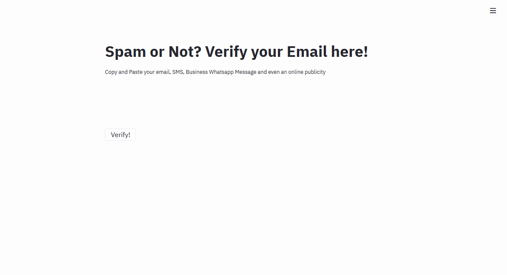

# Spam-Filtering

Reading an Machine Learning Book, was proposed to create some spam filter, and that's what i got, with precision near 100% and a recall of 98%

## Try it Online!

https://spam-filter-v1.herokuapp.com

Look, some gifs of the application running:

And another case:

## How This Works

The repository has 3 principal files:

SpamClassification.ipynb, where I did the Exploratory Data Analysis and the choice of the ideal model.

Classification.py, here's where the system read the saved model, and do the prediction.

Streamlit.py, is the core of the streamlit web application

In the text processing, i made a pipeline, that replace numbers to a string "Number", an url to "URL" and remove ponctuations, so, after all, using the tf-idf algorithm, we fit the vectorization algorithm and generate an vector to train the model.

Related to the machine learning model, i trained many models, like MultinomialNB, SVC, RandomForest, and other, but the best performance was in the SVC with specified parameters,

## TO-DO list

- Use roBERTa pre-trained model (WIP)
- Connect to an Email (Waiting)
- Analize email attachments, like photos (Waiting)
- Get more data and define more classes, like (Spam, Promotional, Job, University) (Waiting)

## Can i use this?

Of Course, if you want to distribute, please give the credits, and if you want to study this, feel free to explore, modify and anything

## How to run local

First, i used python 3.7.5, using anaconda enviroment, but if you want, you can find the Requirements.txt in the repo
>pip install -r Requirements.txt

>streamlit run Streamlit.py

>open http://localhost:port
